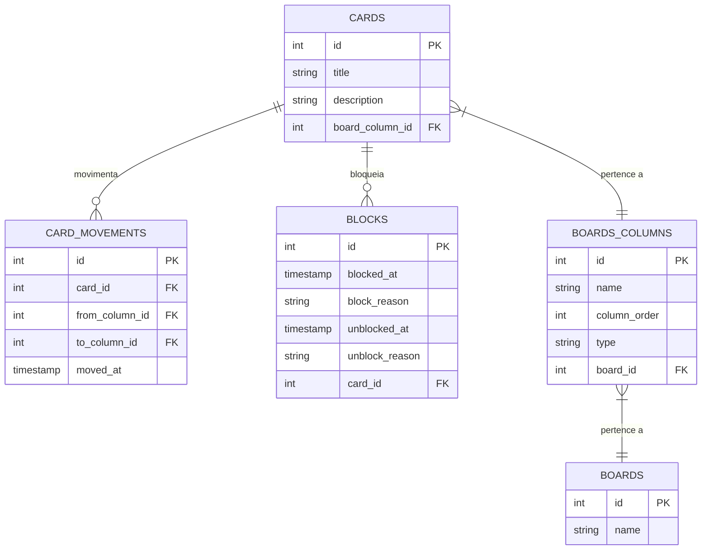

# Task Control

Task Control é uma aplicação de console para gerenciamento de tarefas utilizando um sistema de **cards e colunas**, permitindo a criação de **diferentes boards** para organização eficiente do trabalho.

## Funcionalidades

- Criar, selecionar e excluir **boards**.
- Criar **cards** com título e descrição.
- Mover cards entre colunas conforme a ordem definida no board.
- Bloquear e desbloquear cards com justificativa.
- Cancelar um card a partir de qualquer coluna (exceto a final).
- Gerar relatórios de **tempo gasto por card em cada coluna**.
- Gerar relatórios de **bloqueios de cards** (motivo e tempo bloqueado).

## Modelo de Dados (ERD)

O diagrama abaixo representa a estrutura do banco de dados do **Task Control**:

## Regras de Negócio

### **Requisitos Gerais**
1. O sistema inicia com um **menu principal** com as opções:
   - Criar novo board
   - Selecionar board
   - Excluir board
   - Sair
2. Os boards e suas informações são armazenados no banco de dados MySQL.

### **Regras dos Boards**
1. Cada board deve ter um **nome** e pelo menos **3 colunas**:
   - **Inicial** (para novos cards)
   - **Final** (para tarefas concluídas)
   - **Cancelamento** (para cards cancelados)
2. As colunas têm um **nome**, uma **ordem** no board e um **tipo**:
   - **Inicial** (somente 1 por board)
   - **Final** (somente 1 por board, penúltima coluna)
   - **Cancelamento** (somente 1 por board, última coluna)
   - **Pendente** (quantas forem necessárias, para organização intermediária)
3. Os cards devem **seguir a ordem** das colunas do board, sem pular etapas.
4. A coluna de **cancelamento** pode receber cards de qualquer coluna, exceto a final.
5. Cards **bloqueados** não podem ser movidos até serem desbloqueados.
6. Para bloquear um card, é necessário informar um **motivo**.
7. Para desbloquear um card, também é necessário informar um **motivo**.

### **Menu de Manipulação de Board**
No board selecionado, o menu deve permitir:
- Mover um card para a próxima coluna.
- Cancelar um card.
- Criar um novo card.
- Bloquear e desbloquear um card.
- Fechar board.

## Relatórios Disponíveis

### 1. **Tempo por Card em Cada Coluna**
Gera um relatório com:
- Tempo total para concluir a tarefa.
- Tempo que cada card ficou em cada coluna.

### 2. **Histórico de Bloqueios**
Mostra:
- Tempo total de bloqueio por card.
- Motivos dos bloqueios e desbloqueios.

## Tecnologias Utilizadas

- **Java**
- **MySQL** para persistência dos dados
- **Liquibase** para conexão com o banco de dados
- **Lombok** para redução de boilerplate
- **Mermaid** para diagrama entidade-relacionamento

