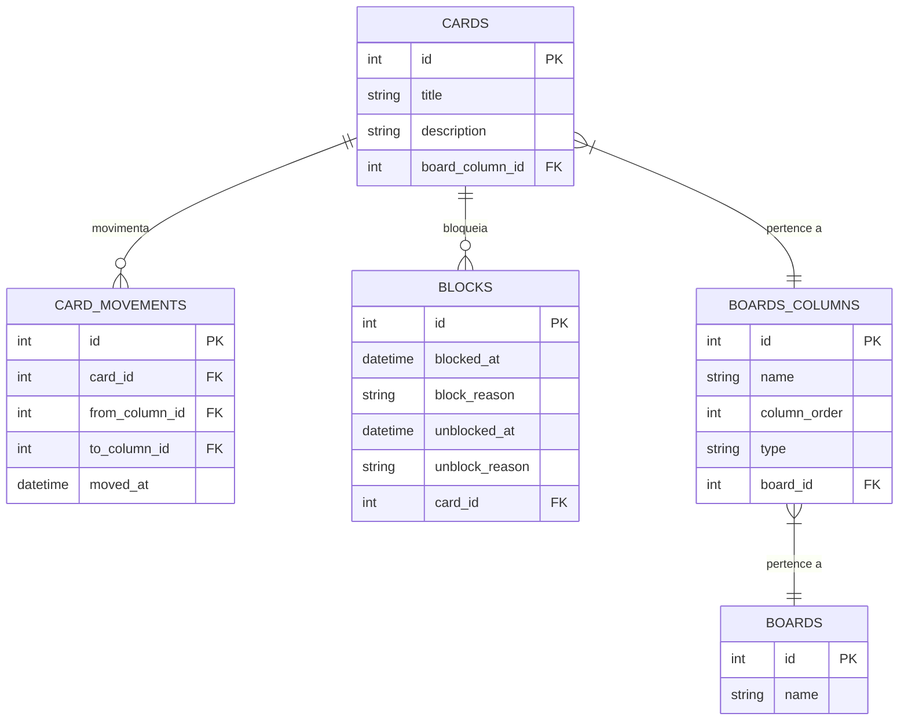

# Task Control
Uma aplicação em console para auxiliar no controle de tarefas utilizando cards e colunas, além disso é possível criar diferentes boards.

## Diagrama entidade-relacionamento do programa
Diagrama produzido baseado nas regras de negócio pedidas no desafio

## Regras de negócio
Todos requisitos foram implementados, incluindo os opcionais.

### Requisitos
    1 - O código deve iniciar disponibilizando um menu com as seguintes opções: Criar novo board, Selecionar board, Excluir boards, Sair;
    2 - O código deve salvar o board com suas informações no banco de dados MySQL;

### Regras dos boards
    1 - Um board deve ter um nome e ser composto por pelo menos 3 colunas ( coluna onde o card é colocado inicialmente, coluna para cards com tarefas concluídas e coluna para cards cancelados, a nomenclatura das colunas é de escolha livre);
    2 - As colunas tem seu respectivo nome, ordem que aparece no board e seu tipo (Inicial, cancelamento, final e pendente);
    3 - Cada board só pode ter 1 coluna do tipo inicial, cancelamento e final, colunas do tipo pendente podem ter quantas forem necessárias, obrigatoriamente a coluna inicial deve ser a primeira coluna do board, a final deve ser a penúltima e a de cancelamento deve ser a última
    4 - As colunas podem ter 0 ou N cards, cada card tem o seu título, descrição, data de criação e se está bloqueado;
    5 - Um card deve navegar nas colunas seguindo a ordem delas no board, sem pular nenhuma etapa, exceto pela coluna de cards cancelados que pode receber cards diretamente de qualquer coluna que não for a coluna final;
    6 - Se um card estiver marcado como bloqueado ele não pode ser movido até ser desbloqueado
    7 - Para bloquear um card deve-se informar o motivo de seu bloqueio e para desbloquea-lo deve-se também informar o motivo

### Menu de manipulação de board selecionado
    1 - O menu deve permitir mover o card para próxima coluna, cancelar um card, criar um card, bloquea-lo, desbloquea-lo e fechar board;

### Requisitos opcionais
    1 - Um card deve armazenar a data e hora em que foi colocado em uma coluna e a data e hora que foi movido pra a próxima coluna;
    2 - O código deve gerar um relatório do board selecionado com o tempo que cada tarefa demorou para ser concluída com informações do tempo que levou em cada coluna
    3 - O código dever gerar um relatório do board selecionado com o os bloqueios dos cards, com o tempo que ficaram bloqueados e com a justificativa dos bloqueios e desbloqueios.
